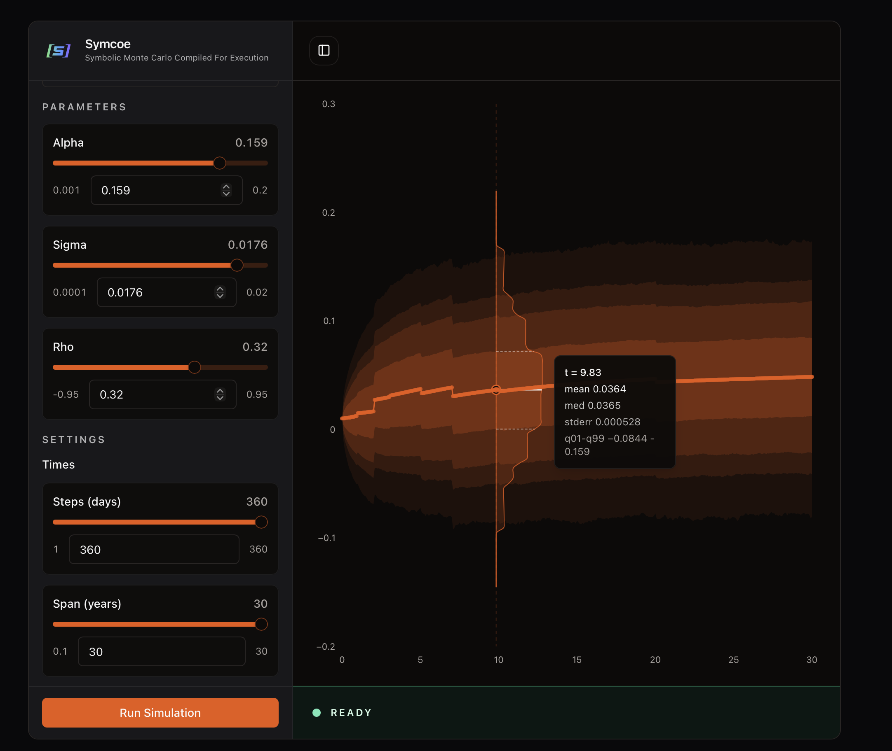

# Selected Demos

## Symcoe Interest Rate Simulations

  

### Description
Interactive examples of interest rate term structure models built with Symcoe. The page collects multiple rate-model simulations, shows both path and curve perspectives, and runs the simulations locally in the browser with tooling designed to handle large plotted datasets without locking up the UI.
### Demonstrated techniques and technologies
- Rust for Monte Carlo simulation and numerical computing
- WebAssembly and web workers for in-browser execution
- Interest rate modeling across short-rate and forward-rate frameworks
- D3 and canvas-based rendering for large simulation plots
- Arrow IPC for efficient transport of typed simulation data
- GPU-accelerated browser-side simulation workflows

## Tick Data API

  

### Description
This notebook uses a market data client I designed for ML feature extraction and research. It queries a massive tick database and aggregates `ohlcv` bars according to the specified parameters. Bars are aggregated by `time`, `tick`, `volume`, and `dollar` values to make the time series friendlier for ML models. Instructions are provided on downloading the data set, but by default it runs off a very rate-limited endpoint tied to my own Snowflake account, for demonstration purposes.
### Demonstrated techniques and technologies
- Snowflake data warehousing
- Python data manipulation with Polars
- Dependency Injection
- Intuitive API design
- Efficient SQL query construction
- Research tooling for ML feature extraction
- HTTP API design and rate-limiting strategies
- AWS Lambda for serverless API hosting
- Database role-based access control and security best practices

## Monte Carlo Simulation

  

### Description
A trippy visualization of modeling the term structure of interest rates using the forward market model. A Rebonato parameterization is exposed to allow you to see the impact of changes in volatility specification as well as initial term structure. The demo runs in real time, and contains links to engine parameterization examples, as well as pricing convergence and `adjoint algorithmic differentiation` results. The engine is fully built in `Rust`.
### Demonstrated techniques and technologies
- Rust for high-performance numerical computing
- WebAssembly for running Rust code in the browser
- Compiler techniques like feature flagging for cross-platform compatibility
- Generic Monte Carlo engine design for flexibility in modeling choices
- React, TypeScript, server-side rendering
- Interest rate modeling
- Adjoint Algorithmic Differentiation for efficient risk sensitivities
- Optimization techniques for path generation and rendering

## SOFR Swap Pricing

  

### Description
The site lets you see the real-time pricing of SOFR swaps. Market data can be bumped or sped up. Pricing happens through Taylor approximations. Sort through 5MM swaps and click on any one of them. You can see its details, risk, cashflows, and fixings. Daily fixings tick along with market data. You can revalue the swap. Click on the counterparty and you see the aggregation of all swaps with that counterparty — the ticking exposure and binned distribution of ticking expected cashflows.

### Demonstrated techniques and technologies
- Python for financial engineering and risk management
- Ability to handle large datasets (5MM swaps) efficiently
- Writing efficient Python code for real-time applications
- Web development with React and TypeScript, and server-side rendering for performance
- Financial engineering concepts like swap pricing, curve calibration, Jacobian and Hessian calculations
- EOD valuation and first- and second-order sensitivity pipeline for efficient intraday revaluation and risk management
- Data visualization for risk and exposure analysis
